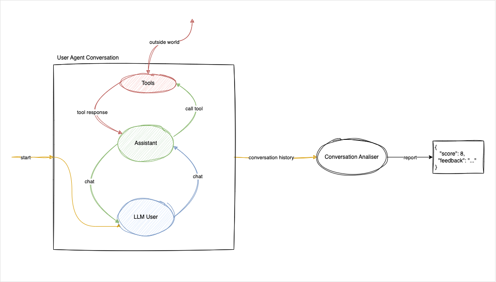

# Testing Conversational Assistants - The Challenge

## Introduction

The popularity of conversational assistants is on the rise, finding applications in various sectors such as customer support and personal services. However, evaluating their performance presents a significant challenge, leading to questions about how to ensure they meet their intended objectives.

This article introduces a method for evaluating the performance of conversational assistants, using a simplified example. Although this example is not derived directly from real-life scenarios, it lays the foundation for practical applications.

## Why is it hard to test conversational assistants?

Conversational assistants, powered by Large Language Models (LLMs), are complex systems that require a different approach to testing. Traditional testing methods, such as unit testing and integration testing, are insufficient for evaluating conversational assistants. These systems engage in dialogue with users, making it challenging to assess their performance using conventional testing techniques.

Conversational assistants are non-deterministic, meaning that the same input may produce different outputs. This variability is due to the inherent nature of LLMs, which generate responses based on probabilities. As a result, testing conversational assistants requires a more nuanced approach that accounts for this non-determinism. Even the tests need some level of non-determinism to account for the variability in conversational responses.

Writing traditional test cases for conversational assistants is challenging due to the dynamic nature of dialogue. The assistant's responses depend on the context of the conversation, making it difficult to predict the exact output. Creating pre-determined scripts for the user is not feasible, as the assistant's responses may differ, even if we use a temperature of 0. So we need to find a way to test the assistant's performance without relying on fixed scripts.

## Simulating Conversations

To test conversational assistants effectively, we need to simulate conversations between users and assistants. This simulation should be dynamic, allowing for variations in user input and assistant responses. By simulating conversations, we can evaluate the assistant's performance in a controlled environment, assessing its ability to understand user requests and provide accurate responses.

One approach to simulating conversations is to use Large Language Models (LLMs) to generate user input for assistant responses. LLMs are capable of generating human-like text, making them ideal for simulating dialogue. By leveraging LLMs, we can create realistic conversations that test the assistant's performance across a range of scenarios.

Different users have different personas. Some users may be more verbose, while others may be more concise. By defining user personas, we can simulate diverse user profiles and evaluate the assistant's ability to engage with different types of users. This approach allows us to test the assistant's performance across a variety of scenarios, ensuring that it can handle a wide range of user interactions.

## Measuring Assistant Quality

When evaluating conversational assistants, we need to consider various aspects of their performance. These include:

- **Conversational Quality**: Assessing the assistant's ability to engage in dialogue effectively, maintain context, and provide relevant responses.
- **Tool Interactions**: Verifying that the assistant correctly interacts with tools to fulfil user requests, such as booking reservations or retrieving information.

To assess conversational quality, we need to evaluate how well the assistant maintains context throughout a conversation. This involves tracking the dialogue history, understanding user intent, and providing appropriate responses. Our best option for this is to use a Large Language Model (LLM) to analyse the conversation and provide feedback on the assistant's performance.

For tool interactions, we need to verify that the assistant correctly triggers the tools to fulfil user requests. This involves testing the assistant's ability to interpret user input, call the appropriate tools, and provide accurate responses. We can achieve this by creating mock tools that simulate the functionality of the real tools and verifying that the assistant interacts with them correctly.
The following diagram illustrates the process of evaluating conversational assistants using simulated conversations:

If you're interested in exploring this further, you can find the complete code for this example in this blog post.

## Exploring the use of BDD style tests for conversational assistants

Behaviour-Driven Development (BDD) is a software development approach that focuses on defining the behaviour of a system from the user's perspective. BDD encourages collaboration between technical and non-technical stakeholders, ensuring that everyone has a shared understanding of the system's behaviour.
In this [blog](https://equalexperts.blogin.co/posts/testing-conversational-assistants-using-bdd-256119), we will explore how to use BDD to test conversational assistants effectively. We will create feature files that describe the expected behaviour of the system, define step definitions that implement this behaviour, and execute the tests using the `behave` library in Python.

We hope this article has been helpful in understanding how to test conversational assistants.

Thank you for reading!
