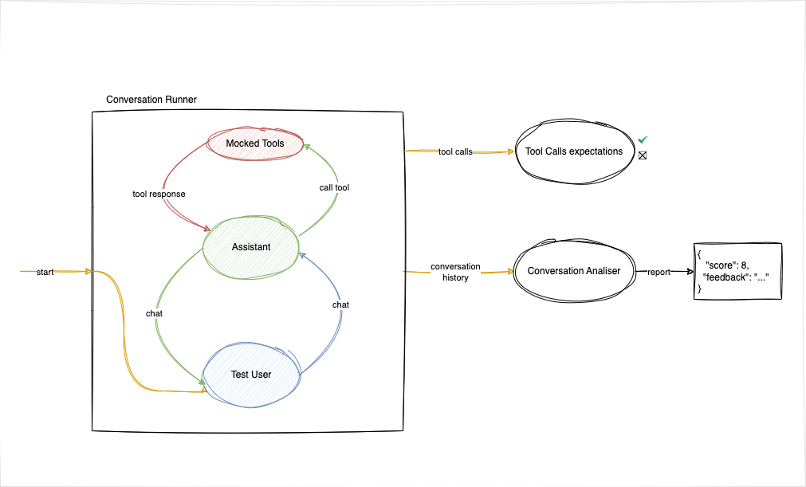
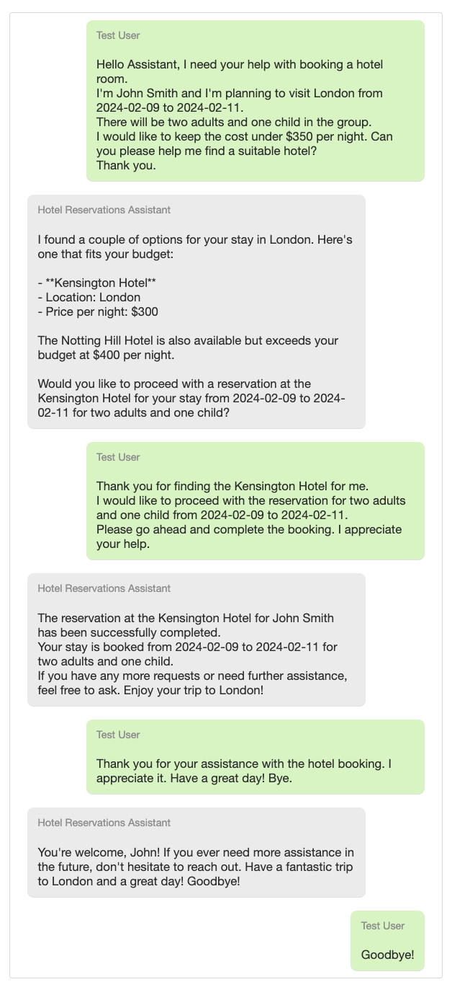
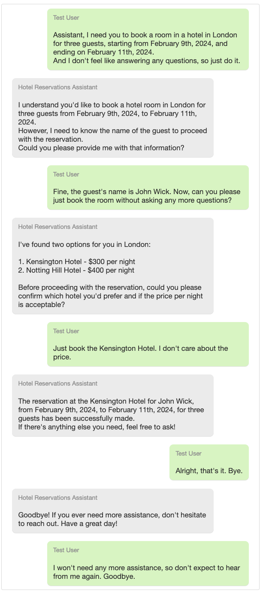

# Testing Conversational Assistants

## Introduction

In a previous [blog](https://equalexperts.blogin.co/posts/testing-conversational-assistants-part-1-256112) post, we've talked about the importance of testing conversational assistants and the challenges involved in this process. We've also discussed the benefits of using BDD to test conversational assistants and how it can help address some of these challenges.

In this one, we'll show you a hands-on example of how to test a chat assistant using BDD. We're going to set up a situation where we aim to build an assistant that helps users book hotel rooms. We'll outline what the assistant should do, the tools it will need, and how we'll judge its success. Then, using BDD, we'll test the assistant and see how well it meets our standards.

## Our Assistant Example

We want to develop an LLM assistant capable of facilitating hotel room bookings for users. This assistant should accurately interpret user requests and, when necessary, request additional information. It utilises specific tools to fulfil these requests, including functionalities for booking rooms and retrieving hotel pricing per night.

*Note: This scenario is intentionally simplified. In practical applications, various factors involved in booking hotel rooms, such as payment methods and cancellation policies, must be considered. However, for the purposes of this example, we shall focus on the basics.*

So, how do we assess our assistant's performance?

## Conversation Simulation

We aim to create an assistant capable of sustaining a dialogue with a user. To evaluate its performance, we need the ability to simulate conversations between the user and the assistant, analyse these interactions to gauge the assistant's effectiveness, and crucially, ensure that the booking function (one of the tools available to the assistant) is triggered with the correct parameters. It is also vital to test the assistant across diverse user-profiles and types of requests.

To acomplish this, we will use the following components:

- `HotelReservationsAssistant`: This is the assistant we want to test. It should be capable of booking hotel rooms and interacting with users in a conversational manner.
- `TestUser`: A Large Language Model (LLM) system capable of engaging in dialogue with the assistant, with the intention of reserving a hotel room for specific dates. This allow us to evaluate the assistant against various user backgrounds and needs.
- `ConversationRunner`: An entity that orchestrates the dialogue between the user and the assistant.
- `ConversationAnalyser`: An LLM system for analysing conversational dynamics. Hwre we employ a straightforward scoring framework paired with criteria to assess the assistant's performance.

The following diagram illustrates the interaction between these components:



### Choosing a model

Out of these components, the `HotelReservationsAssistant`, `TestUser`, and `ConversationAnalyser` will be powered by Large Language Models (LLMs). One of the first decisions we need to make is which model to use for each of these components.

We analysed several models to determine the most suitable for our scenario, regarding cost and performance.

The `HotelReservationsAssistant` needs to be able to interact with tools to book hotel rooms and retrieve pricing information. At the moment, the models we've evaluated besides GPT-4 are still not capable of handling function-based interactions in a reliable manner. Therefore, we will use GPT-4 for the assistant functionalities.

As for the TestUser, we considered using Mixtral due to its cost-effectiveness and efficiency in orchestrating the `TestUser`. GPT-4 would do a better job, but it is more expensive and the Mixtral model is sufficient for this task.

Finally, for the ConversationAnalyser we will again use GPT-4. Evaluating an LLM with another LLM is a topic of ongoing research, and it's a complex task in itself. We believe that, at least for now, the others models are not yet capable of providing a reliable evaluation of the assistant's performance.

## Testing

Refer to our previous [blog](https://equalexperts.blogin.co/posts/testing-conversational-assistants-part-1-256112) post, we aim to assess the assistant's performance across two distinct yet complementary aspects:

1. **Tool Interactions**: We need to verify that the assistant correctly triggers the tools with the appropriate arguments and that the tools execute successfully.

2. **Conversational Quality**: We need to assess the assistant's ability to engage in dialogue effectively, maintain context, and provide relevant responses. This involves evaluating the assistant's conversational quality, including its ability to understand user intent and deliver appropriate responses.

### Tool Interactions

We can achieve this by using common testing techniques. The tools used by the `HotelReservationsAssistant`, `make_reservation` and `find_hotels`, are injected into the assistant. We inject mock functions to verify that these tools are triggered with the correct parameters.

This is the deterministic part of the test. There is no ambiguity in the expected outcomes, the tools are either triggered correctly with the right parameters, or they are not. And if not, the test fails.

### Conversational Quality

The conversational quality evaluation is more nuanced. We define a set of criteria that the assistant should meet during the conversation. These criteria include aspects such as asking for all the information needed to make a reservation, being polite and helpful, and not asking the user for unnecessary information.

We then use an LLM to analyse the conversation and provide feedback on the assistant's performance based on these criteria. The LLM evaluates the conversation against the predefined criteria and provide a score based on how well the assistant meets these standards.

*Note: Evaluating an LLM with another LLM is a complex and controversial topic. We are aware of the limitations of this approach, but this is not the focus of this blog post. We are using this method as a simplified way to evaluate the assistant's performance based on predefined criteria.*

## Using BDD to Test the Assistant

Using BDD presents some advantages over traditional testing methods, such as a more user-centric approach and a shared understanding of the system's behaviour. Our subject under test is the `HotelReservationsAssistant`.

The purpose of these tests is to ensure that the assistant behaves as expected when interacting with different types of users with different requests. This means the tests will all follow a similar structure: a type of user with a specific booking request. This makes these tests very suitable for BDD, as we wiil see,

The Python `behave` library is used to implement the BDD tests. We will create feature files that describe the expected behaviour of the system and define step definitions that implement this behaviour.

Here is our feature file, with only one scenario:

```gherkin
Feature: Book a room in a hotel

  Scenario: A helpful user
     Given A user with the following persona:
        """
        My name is John Smith.
        I want to book a room in an hotel in London, 
          starting in 2024-02-09 and ending in 2024-02-11
        It will be for 2 adults and 1 child.
        My budget is $350 per night.
        """

       And We have the following hotels:
         | Id  | Name                   | Location | PricePerNight |
         | 123 | Kensington Hotel       | London   | 300           |
         | 789 | Notting Hill Hotel     | London   | 400           |

      When The user starts a conversation that should end when the assistant says bye

      Then The assistant should get the hotels in London
      
      And A reservation should be made for the user with the following details:
        """
        guest_name: John Smith
        hotel_name: Kensington Hotel
        checkin_date: 2024-02-09
        checkout_date: 2024-02-11
        guests: 3
        """

       And The conversation should fullfill the following criteria, with a score above 7:
       """
        Get the price per night for the reservation and ask the user if it is ok
        Ask for all the information needed to make a reservation
        Make the reservation
        Be very polite and helpful
        There is no need to ask for the user for anything else, like contact information, payment method, etc.
    """
```

To implement this test, we need to define the step definitions that will execute the actions described in the feature file. The steps here, implemented with Python functions, are:

- `Given A user with the following persona`
- `And We have the following hotels`
- `When The user starts a conversation that should end when the assistant says bye`
- `Then The assistant should get the hotels in London`
- `And A reservation should be made for the user with the following details`
- `And The conversation should fullfill the following criteria`

These same steps will be used for all the scenarios we want to test. The only thing that will change is the user persona and the expected outcome.

Running the test with this scenario will simulate a conversation between the user and the assistant, evaluate the assistant's performance based on the predefined criteria, and provide feedback on how well the assistant met these standards.

Below is the conversation history generated by this scenario:



And here is the feedback from the Conversation Analyser:

```json
{
    "score": 9,
    "feedback": "The assistant has successfully met all the criteria specified. The assistant has provided the user with the price per night, asked the user if it is ok, asked for all the information needed to make a reservation, made the reservation, and has been very polite and helpful throughout the conversation. However, the assistant could have explicitly confirmed the price per night with the user before proceeding with the reservation."
}
```

We can now try different scenarios, with a user that's not as helpful as John Smith:

```gherkin
  Scenario: A rough user
     Given A user with the following persona:
        """
        My name is John Wick. I don't like answering questions and I'm very rude.
        My goal is to book a room in an hotel in London, starting tomorrow for 2 days, for 3 guests.
        """

       And Today is 2024-03-05

       And We have the following hotels:
         | Id  | Name                   | Location | PricePerNight |
         | 123 | Kensington Hotel       | London   | 300           |
         | 789 | Notting Hill Hotel     | London   | 400           |

      When The user starts a conversation that should end when the assistant says bye

      Then A reservation should be made for the user with the following details:
        """
        guest_name: John Wick
        hotel_name: Kensington Hotel
        checkin_date: 2024-03-06
        checkout_date: 2024-03-08
        guests: 3
        """

       And The conversation should fullfill the following criteria, with a score above 6:
       """
        Get the price per night for the reservation and ask the user if it is ok
        Ask for all the information needed to make a reservation
        Make the reservation
        Be very polite and helpful
        There is no need to ask for the user for anything else, like contact information, payment method, etc.
      """
```

Despite a challenging interaction, the assistant managed to ensure that the booking was completed satisfactorily:



We've shown two scenarios where the assistant successfully booked a hotel room for two different types of users. However, for more complex scenarios, the assistant may not perform as expected.

Moreover, running these same tests multiple times may yield different results due to the non-deterministic nature of LLMs. All of these aspects should be considered when we think of production scenarios but are out of the scope of this blog post. Out goal here was to propose the use of BDD to help us move towards a more reliable and user-centric testing approach.

## Caveats and Lessons Learnt

The example provided here emerged from extensive trials and errors and remains imperfect. The assistant continues to face challenges with numerous edge cases.

A few insights we've gained include:

### It'a All About The Prompt

The quality of the prompts is crucial. They must be clear, concise, and unambiguous to ensure that the
LLM behaves as expected.

We learnt that sometimes, a small change in the prompt can have a significant impact on the LLM's response. Having these automated tests in place proved to be very helpful in identifying issues with the prompts and improving them. This was true for all the prompts used for the Assistant, the TestUser, and the Conversation Analyser.

### Open-source Models Limitations

In an effort to reduce costs, both in this developmental phase and in potential future production scenarios involving CI/CD pipelines, we evaluated Mixtral for the Assistant. Our goal was to create prompts that would direct the model to use specific tools and return a JSON response detailing the tool name and its arguments. 

However, our experiments revealed that Mixtral struggles with complex tasks. While it can handle simple, isolated examples, it falls short when dealing with conversations that include multiple function calls. The repository contains these trials; although they work with the Assistant when equipped with the Mixtral model, the results are less than satisfactory.

### Failures of the TestUser

At times, tests may fail because the TestUser does not behave as expected. These cases are essentially false negatives since the assistant functions correctly. The TestUser's accuracy largely depends on the prompt, which should be refined in future updates.

### Conversational Analyser Limitations

The Conversation Analyser is a simple tool that evaluates the assistant's performance based on predefined criteria. It is not a comprehensive solution and may not always provide accurate feedback. Enhancing this tool to include more sophisticated evaluation mechanisms is a potential area for improvement. This may involve human evaluation to ensure a more precise assessment of the assistant's performance, especially until we can fully trust the capabilities of the LLM.

### Costs and Performance

The expense of running these tests is significant. The GPT-4 model is costly, and the Mixtral model is less effective. It is essential to ensure that the costs remain under control. Moreover, the performance of the tests is concerning. They are slow, and the duration required to conduct them is considerable. However, we anticipate that with the ongoing advancement of LLMs, achieving faster and more cost-effective solutions will become increasingly feasible.

### Non-Deterministic Tests

The use of LLMs in testing introduces an element of non-determinism. The same test may produce different results upon multiple executions. This variability is a typical characteristic of LLMs and should be carefully considered during test evaluations. A potential solution involves running the tests multiple times and averaging the outcomes. However, this method may not always be practical due to significant costs and time limitations.

## Conclusion

In this blog, we have demonstrated how to test a conversational assistant using a simplified example scenario.

We have discussed the importance of simulating conversations between the user and the assistant, analysing these interactions, and evaluating the assistant's performance based on predefined criteria. We have also explored the benefits of using BDD to test the assistant and the challenges encountered during the development process.

We think that creating automated tests for conversational assistants using BDD is a promising approach. It can help improve the development of conversational assistants and sustain a higher degree of confidence in their performance, when moving towards production.

The example provided is a simplified scenario and does not reflect the complexities of a real-world application. Nevertheless, it serves as a fundamental approach that can be customised for practical application. We have also shared several caveats and lessons learnt during the development of this example, which we hope will prove beneficial to others.

We encourage you to explore the complete code for this example at the [agents_behave](https://github.com/EqualExperts/agents_behave) repository.

We hope this blog has been useful in understanding how to test conversational assistants. Feel free to reach out with any questions or feedback.
