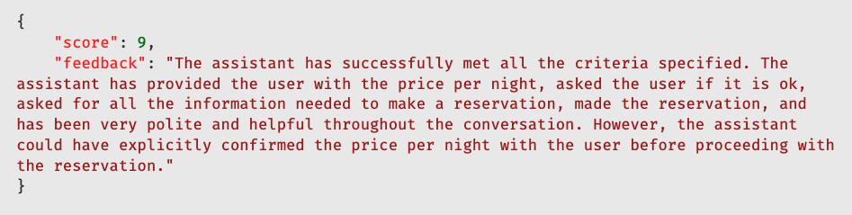

# Testing Conversational Assistants Using BDD

## Introduction

In a previous [blog post](https://equalexperts.blogin.co/posts/testing-conversational-assistants-part-1-256112), we discussed the importance of testing conversational assistants and the challenges involved in this process. We've also discussed the benefits of using Behavior-Driven Development (BDD) to test conversational assistants and how it can help address some of these challenges.

In this blog, we'll show you a hands-on example of how to test a conversational assistant using BDD. We aim to build an assistant that helps users book hotel rooms. We'll outline what the assistant should do, the tools it will need, and how we'll judge its success. Then we'll test the assistant using BDD techniques and evaluate its performance.

You can find the complete code for this example in this [repository](https://github.com/EqualExperts/agents-behave).

## Our Assistant Example

We want to develop a Large Language Model (LLM) assistant capable of facilitating hotel room bookings for users. This assistant should precisely interpret user requests and, when required, seek further information. It can utilise specific tools to fulfil these requests, including functionalities for booking rooms and retrieving hotel pricing per night.

*Note: This scenario has been intentionally simplified for illustrative purposes. In real-life applications, numerous factors associated with booking hotel rooms, including payment methods and cancellation policies, need to be taken into account. Nonetheless, for the sake of this example, we will concentrate on the fundamental aspects.*

So, how do we assess our assistant's performance?

## Conversation Simulation

To evaluate the performance of our Assistant, we need to:

- simulate conversations between the user and the assistant,
- analyse these interactions to gauge the assistant's effectiveness,
- ensure that the booking function, one of the tools available to the assistant, is triggered with the correct parameters.

To accomplish this, we will use the following components:

- `HotelReservationsAssistant`: This is the assistant we want to test. It should be capable of booking hotel rooms and interacting with users in a conversational manner.
- `TestUser`: An LLM system capable of engaging in dialogue with the assistant, with the intention of reserving a hotel room for specific dates. This enables us to assess the assistant against various user backgrounds and needs.
- `ConversationRunner`: An entity that orchestrates the dialogue between the user and the assistant.
- `ConversationAnalyser`: An LLM system for analysing conversational dynamics. Here we employ a straightforward scoring framework paired with criteria to assess the assistant's performance.

The following diagram illustrates the interaction between these components:

### Choosing a model

Out of these components, the `HotelReservationsAssistant`, `TestUser`, and `ConversationAnalyser` will be powered by Large Language Models (LLMs). One of the first decisions we need to make is which model to use for each of these components.

We analysed several models to determine the most suitable for our scenario, regarding cost and performance.

The `HotelReservationsAssistant` must be able to interact with tools to book hotel rooms and retrieve pricing information. At the moment, the models we've evaluated besides GPT-4 are still not capable of handling function-based interactions reliably. Therefore, we will use GPT-4 for the assistant functionalities.

As for the TestUser, we considered using Mixtral due to its cost-effectiveness and efficiency in orchestrating the `TestUser`. GPT-4 would perform better, but it is more expensive, whereas the Mixtral model is sufficiently efficient for this task.

Finally, for the `ConversationAnalyser` we will again use GPT-4. Evaluating an LLM with another LLM is a subject of ongoing research, and it's a complex task in itself. We believe that, at least for now, the other models are not yet capable of providing a reliable evaluation of the assistant's performance.

## Testing

Referring to our previous [blog post](https://equalexperts.blogin.co/posts/testing-conversational-assistants-part-1-256112), we aim to assess the assistant's performance across two distinct yet complementary aspects:

1. **Tool Interactions**: We need to verify that the assistant correctly triggers the tools with the appropriate arguments and that the tools execute successfully.

2. **Conversational Quality**: We need to assess the assistant's ability to engage in dialogue effectively, maintain context, and provide relevant responses. This involves evaluating the assistant's conversational quality, including its ability to understand user intent and deliver appropriate responses.

### Tool Interactions

We can achieve this by using common testing techniques. The tools used by the `HotelReservationsAssistant`, namely `make_reservation` and `find_hotels`, are injected into the assistant. When running the tests, we inject mock functions to verify that these tools are triggered with the correct parameters.

This part of the test is deterministic. There is no ambiguity in the expected outcomes, the tools are either triggered correctly with the right parameters, or they are not. And if not, the test fails.

### Conversational Quality

The conversational quality evaluation is more nuanced. We define a set of criteria that the assistant should meet during the conversation. These criteria include aspects such as asking for all the information needed to make a reservation, being polite and helpful, and not asking the user for unnecessary information.

We then use an LLM to analyse the conversation and provide feedback on the assistant's performance based on these criteria. The LLM evaluates the conversation against the predefined criteria and provides a score based on how well the assistant meets these standards.

Here we are dealing with non-deterministic tests. The evaluation of the assistant's performance is subjective and may vary depending on the LLM's interpretation of the conversation. Due to the inherent variability of LLMs, the same conversation may yield different results upon multiple executions.

*Note: Evaluating an LLM with another LLM is a complex and controversial topic. We are aware of the limitations of this approach, but this is not the focus of this blog post.*

## Using BDD to Test the Assistant

Using BDD presents some advantages over traditional testing methods, such as a more user-centric approach and a shared understanding of the system's behaviour.

The purpose of these tests is to ensure that the assistant behaves as expected when interacting with different types of users with different requests. This means the tests will all follow a similar structure: a type of user with a specific booking request. This makes these tests very suitable for BDD.

The Python `behave` library is used to implement the BDD tests. Here is our first scenario:

Running the test with this scenario will simulate a conversation between the user and the assistant, evaluate the assistant's performance based on the predefined criteria, and provide feedback on how well the assistant met these standards.

Below is the conversation history generated by running this test:

And here is the feedback from the Conversation Analyser:

We can now try different scenarios, with a user that's not as helpful as John Smith, for example:

Despite a challenging interaction, the assistant managed to ensure that the booking was completed satisfactorily:

We've shown two scenarios where the assistant successfully booked a hotel room for two different types of users. This success was not achieved on the first try; it required several iterations to refine the prompts and improve the assistant's performance. 

The automated tests were instrumental in identifying issues with the prompts and enhancing them. Changes were made to the prompts based on the feedback from the tests, which ultimately led to the successful completion of the scenarios.

If later we need to change the assistant's prompts, we can run these tests again to ensure that the assistant continues to behave as expected.

## Caveats and Lessons Learnt

The example provided here emerged from extensive trials and errors and remains imperfect. The assistant continues to face challenges with numerous edge cases.

A few insights we've gained include:

### It's All About The Prompt

The quality of the prompts is crucial. They must be clear, concise, and unambiguous to ensure that the
LLM behaves as expected.

We learnt that sometimes, a small change in the prompt can have a significant impact on the LLM's response. Having these automated tests in place proved to be very helpful in identifying issues with the prompts and improving them. This was true for all the prompts used for the Assistant, the TestUser, and the Conversation Analyser.

### Open-source Models Limitations

To reduce costs, both in this developmental phase and in potential future production scenarios involving CI/CD pipelines, we evaluated Mixtral for the Assistant. Our goal was to create prompts that would direct the model to use specific tools and return a JSON response detailing the tool name and its arguments. 

However, our experiments revealed that Mixtral struggles with complex tasks. While it can handle simple, isolated examples, it falls short when dealing with conversations that include multiple function calls. The repository contains these trials; although they work with the Assistant when equipped with the Mixtral model, the results are less than satisfactory.

### Failures of the TestUser

At times, tests may fail because the TestUser does not behave as expected. These cases are essentially false negatives since the assistant functions correctly. The TestUser's accuracy largely depends on the prompt, which should be refined in future updates.

### Conversational Analyser Limitations

The Conversation Analyser is a simple tool that evaluates the assistant's performance based on predefined criteria. It is not a comprehensive solution and may not always provide accurate feedback. Enhancing this tool to include more sophisticated evaluation mechanisms is a potential area for improvement. This may involve human evaluation to ensure a more precise assessment of the assistant's performance, especially until we can fully trust the capabilities of the LLM.

### Costs and Performance

The expense of running these tests is significant. The GPT-4 model is costly, and the Mixtral model is less effective. It is essential to ensure that the costs remain under control. Moreover, the performance of the tests is concerning. They are slow, and the duration required to conduct them is considerable. However, we anticipate that with the ongoing advancement of LLMs, achieving faster and more cost-effective solutions will become increasingly feasible.

### Non-Deterministic Tests

The use of LLMs in testing introduces an element of non-determinism. The same test may produce different results upon multiple executions. This variability is a typical characteristic of LLMs and should be carefully considered during test evaluations. A potential solution involves running the tests multiple times and averaging the outcomes. However, this method may not always be practical due to significant costs and time limitations.

## Conclusion

In this blog, we have demonstrated how to test a conversational assistant using BDD.

We have discussed the importance of simulating conversations between the user and the assistant, analysing these interactions, and evaluating the assistant's performance based on predefined criteria. We have also explored the benefits of using BDD to test the assistant and the challenges encountered during the development process.

We think that creating automated tests for conversational assistants using BDD is a promising approach. It can help improve the development of conversational assistants and sustain a higher degree of confidence in their performance when moving towards production.

The example provided is a simplified scenario and does not reflect the complexities of a real-world application. Nevertheless, it serves as a fundamental approach that can be customised for practical application. We have also shared several caveats and lessons learnt during the development of this example, which we hope will prove beneficial to others.

We encourage you to explore the complete code for this example at the [agents-behave](https://github.com/EqualExperts/agents-behave) repository.

We hope this blog has been useful in understanding how to test conversational assistants. Feel free to reach out with any questions or feedback.
