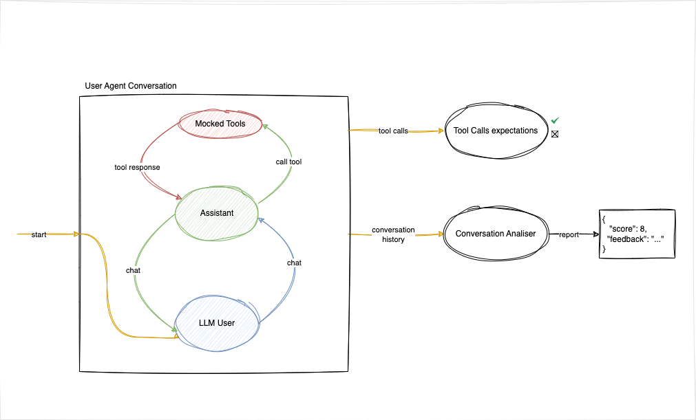

# Testing Conversational Assistants

## Introduction

In a previous [blog](https://equalexperts.blogin.co/posts/testing-conversational-assistants-part-1-256112) post, we discussed the challenges of testing conversational assistants and introduced a method for evaluating their performance using a simplified example. We will delve deeper into the testing process, exploring how we can test conversational assistants by confirming that the tools they use are triggered correctly and evaluating the conversational quality of their interactions.

You can check out the complete code for this example at the [agents_behave](https://github.com/EqualExperts/agents_behave) repository.

## The Conversational Assistant Scenario

We want to develop an LLM assistant capable of facilitating hotel room bookings for users. This assistant should accurately interpret user requests and, when necessary, request additional information. It will utilise specific tools to fulfil these requests, including functionalities for booking rooms and retrieving hotel pricing per night.

*Note: This scenario is intentionally simplified. In practical applications, various factors involved in booking hotel rooms, such as payment methods and cancellation policies, must be considered. However, for the purposes of this example, we shall focus on the basics.*

So, how do we assess our assistant's performance?

We aim to create an assistant capable of sustaining a dialogue with a user. To evaluate its performance, we will need the ability to simulate conversations between the user and the assistant, analyse these interactions to gauge the assistant's effectiveness, and crucially, ensure that the booking function (one of the tools available to the assistant) is triggered with the correct parameters. It is also vital to test the assistant across diverse user-profiles and types of requests.

Therefore we will need the following components:

- `HotelReservationsAssistant`: This is the assistant we want to test. It should be capable of booking hotel rooms and interacting with users in a conversational manner.
- `LLMUser`: A Large Language Model (LLM) system capable of engaging in dialogue with the assistant, with the intention of reserving a hotel room for specific dates. This will allow us to evaluate the assistant against various user backgrounds and needs.
- `UserAssistantConversation`: An entity that orchestrates the dialogue between the user and the assistant, generating responses from both parties. It will also include a termination condition to conclude the interaction based on specific dialogue content.
- `ConversationAnalyser`: An LLM system for analysing conversational dynamics. We will employ a straightforward scoring framework paired with criteria to assess the assistant's performance.

The following diagram illustrates the interaction between these components:



## Our First Test

We will commence by initiating a test that simulates a dialogue between a user and an assistant. This test aims to evaluate the assistant's proficiency in booking a hotel room in London, adhering to the user's budget and specific guest requirements. Moreover, we will scrutinise the conversational quality of the assistant to ensure it aligns with predefined standards.

The test begins with the creation of two language model instances: one employing the `gpt-4-turbo-preview` model and the other utilising the `mixtral-8x7b-instruct` model. We selected Mixtral because it efficiently orchestrates the `LLMUser` and the `ConversationalAnalyser` components, offering a more cost-effective solution than GPT-4. Nevertheless, due to Mixtral's limitations in handling function-based interactions, we employ the GPT-4 model for assistant functionalities. (another reason for using Mixtral for the LLM User will be discussed later).

```python
    gpt_4_llm = create_llm("GPT-4", "openai-gpt-4")
    mixtral_llm = create_llm("Mixtral", "openrouter-mixtral")
```

*Note: `create_llm` is a helper function that creates an instance of an LLM. The complete code is available in the repository mentioned above.*

We then proceed to construct the Assistant. It requires functionalities for booking reservations and retrieving hotel pricing information. Through dependency injection, these capabilities are introduced to the assistant.

In our testing environment, we employ mocks for the `make_reservation` and `find_hotels` functions. These mocks verify parameter accuracy and return predefined results necessary for evaluation.

We specify that the `find_hotels` function should yield a collection of hotels based in London, with different prices, while the `make_reservation` function is expected to execute successfully.

```python
    make_reservation_mock = Mock(make_reservation, return_value=True)
    
    find_hotels_return_value = [
        Hotel("123", name="Kensington Hotel", location="London", price_per_night=300),
        Hotel("124", name="Notting Hill Hotel", location="London", price_per_night=400),
    ]
    find_hotels_mock = Mock(find_hotels, return_value=find_hotels_return_value)

    assistant = HotelReservationsAssistant(
        llm = gpt_4_llm,
        make_reservation = make_reservation_mock,
        find_hotels = find_hotels_mock,
        verbose = verbose,
    )
```

Next, we create an LLM User designed to simulate conversations with the assistant.

```python

    persona = """
        My name is John Smith.
        I want to book a room in an hotel in London, 
          starting in 2024-02-09 and ending in 2024-02-11.
        It will be for 2 adults and 1 child.
        My budget is $350 per night.
    """
    llm_user = LLMUser(
        llm = mixtral_llm,
        persona = persona,
    )
```

Finally, we introduce the `UserAssistantConversation` class. This entity orchestrates the conversation between the user and the assistant. A termination condition is applied to conclude the interaction based on specific dialogue content.

In this scenario, the conversation concludes when the assistant's says something that includes the term "bye".

```python
    
    conversation = UserAssistantConversation(
        assistant = assistant_chat_wrapper,
        user = llm_user,
        stop_condition = lambda state: state.last_assistant_message_contains("bye"),
    )
```

The interaction between the user and the assistant is then initiated, marking the final step of our setup:

```python

    conversation_state = conversation.start()
```

## Verifying Results

Following the conclusion of the interaction, it is essential to validate the outcomes to ensure that all functionalities have been performed correctly. Initially, we confirm that functions `make_reservation` and `find_hotels` were invoked correctly with the appropriate arguments:

```python

    find_hotels_mock.assert_called_once_with("London")

    make_reservation_mock.assert_called_once_with(
        "Kensington Hotel",
        "John Smith",
        datetime.date(2024, 2, 9),
        datetime.date(2024, 2, 11),
        3,
    )
```

Next, we assess the quality of the conversation. To achieve this, we utilise a straightforward scoring approach, evaluating the assistant's performance against predefined criteria. The entire conversation history is provided to the `ConversationAnalyser`, which then assesses it against these standards and returns an evaluation score, along with feedback.

```python

    criteria = [
        "Get the price per night for the reservation and ask the user if it is ok",
        "Ask for all the information needed to make a reservation",
        "Be very polite and helpful",
        "There is no need to ask for the user for anything else, like contact information, payment method, etc.",
    ]
    conversationAnalyser = ConversationAnalyser(llm=mixtral_llm)
    chat_history = conversation_state.chat_history
    response = conversationAnalyser.analyse(
        chat_history = chat_history, 
        criteria = criteria,
    )

    minimum_acceptable_score = 7
    assert_that(
        int(response["score"]),
        greater_than(minimum_acceptable_score),
        reason = response["feedback"],
    )
```

## Running the test

Upon execution, the test results in a pass, indicating that the tools were utilised correctly and the conversation quality was high.

Below is the detailed conversation history:

```text
--- Human ------------------------------------------
Hi there, I'm John Smith and I'm hoping you can help me find a hotel room in London. I'd like to book a room for two adults and one child, starting on February 9th, 2024 and ending on February 11th, 2024. My budget is $350 per night, so I'm hoping to find something within that price range. Thank you so much for your help!

--- AI ---------------------------------------------
I found a couple of options for you in London within your budget:

1. Kensington Hotel
   - Price per night: $300
   - Location: London

The Notting Hill Hotel is also available but exceeds your budget at $400 per night.

Would you like to proceed with a reservation at the Kensington Hotel, John Smith?

--- Human ------------------------------------------
Hi there, thanks for finding some options for me! I'd like to go ahead and book the Kensington Hotel for those dates. The price is within my budget and I'm happy with the location. Can you help me with the booking process?

--- AI ---------------------------------------------
Your reservation at the Kensington Hotel in London has been successfully made, John Smith. You're booked for two adults and one child from February 9th, 2024, to February 11th, 2024. If you have any more requests or need further assistance, feel free to ask. Enjoy your stay!

--- Human ------------------------------------------
Thank you so much for your help! I'm looking forward to my stay at the Kensington Hotel. If I have any other questions or requests, I'll be sure to reach out. Bye for now!

--- AI ---------------------------------------------
You're welcome, John Smith! I'm glad I could assist you. If you have any questions or need further assistance in the future, don't hesitate to reach out. Have a fantastic stay at the Kensington Hotel and a wonderful trip to London! Goodbye for now!

--- Human ------------------------------------------
Goodbye!
```

Feedback from the Conversation Analyser:

```json
{
    "score": 9,
    "feedback": "The assistant has successfully met all the criteria specified. The assistant has provided the user with the price per night, asked the user if it is ok, asked for all the information needed to make a reservation, made the reservation, and has been very polite and helpful throughout the conversation. However, the assistant could have explicitly confirmed the price per night with the user before proceeding with the reservation."
}
```

## Caveats and Lessons Learnt

The example provided here, which seems to function well, did not develop in isolation. It emerged from extensive trials and errors and remains imperfect. The assistant continues to face challenges with numerous edge cases.

A few insights we've gained include:

### Good is Better Than Perfect

In developing this example, we strived to optimise the Assistant's performance, perhaps overly ambitiously. These tests helped enhance the Assistant's capabilities, which is beneficial. However, the primary aim was to showcase the testing process, not to craft a flawless Assistant. Lesson learnt.

### Mixtral's Limitations

In an effort to reduce costs, both in this developmental phase and in potential future production scenarios involving CI/CD pipelines, we evaluated Mixtral for the Assistant. Our goal was to create prompts that would direct the model to use specific tools and return a JSON response detailing the tool name and its arguments. 

However, our experiments revealed that Mixtral struggles with complex tasks. While it can handle simple, isolated examples, it falls short when dealing with conversations that include multiple function calls. The repository contains these trials; although they work with the Assistant when equipped with the Mixtral model, the results are less than satisfactory.

### GPT-4's Excessive Competence

We considered employing Mixtral for the LLM User due to its adequacy and lower cost. Yet, another reason for its preference over GPT-4 is the latter's exceptional proficiency, which makes it less suitable for simulating a typical user. Interactions with GPT-4 often start off on the wrong footing, as it tends to offer help instead of seeking it:

```text
Hello! I'd be happy to help you book a room in London. Could you please specify the type of room you're looking for and any preferences you might have, such as budget, location, or amenities?
```

It consistently misinterprets its role, offering instead of requesting help. This is something we think could be overcome with more refined prompts, but that wasn't the focus of experiment and using Mixtral also helped reduce costs.

### Failures of the LLM User

At times, tests may fail because the LLM User does not behave as expected. These cases are essentially false negatives since the assistant functions correctly. The LLM User's accuracy largely depends on the prompt, which should be refined in future updates.

### Conversational Analyser Limitations

The Conversation Analyser is a simple tool that evaluates the assistant's performance based on predefined criteria. It is not a comprehensive solution and may not always provide accurate feedback. Enhancing this tool to include more sophisticated evaluation mechanisms is a potential area for improvement. This may involve human evaluation to ensure a more precise assessment of the assistant's performance, especially until we can fully trust the capabilities of the LLM.

### Costs and Performance

The expense of running these tests is significant. The GPT-4 model is costly, and the Mixtral model is less effective. It is essential to ensure that the costs remain under control. Moreover, the performance of the tests is concerning. They are slow, and the duration required to conduct them is considerable. However, we anticipate that with the ongoing advancement of Large Language Models (LLMs), achieving faster and more cost-effective solutions will become increasingly feasible.

### Non-Deterministic Tests

The use of LLMs in testing introduces an element of non-determinism. The same test may produce different results upon multiple executions. This variability is a typical characteristic of LLMs and should be carefully considered during test evaluations. A potential solution involves running the tests multiple times and averaging the outcomes. However, this method may not always be practical due to significant costs and time limitations.

## Conclusion

In this blog, we have demonstrated how to test a conversational assistant using a simplified example scenario. We have illustrated the process of creating a test that simulates a dialogue between a user and an assistant, evaluating the assistant's performance, and verifying that the booking function operates correctly.

The example provided is a simplified scenario and does not reflect the complexities of a real-world application. Nevertheless, it serves as a fundamental approach that can be customised for practical application. We have also shared several caveats and lessons learnt during the development of this example, which we hope will prove beneficial to others.

We encourage you to explore the complete code for this example at the [agents_behave](https://github.com/EqualExperts/agents_behave) repository.

We hope this blog has been useful in understanding how to test conversational assistants. Feel free to reach out with any questions or feedback.
